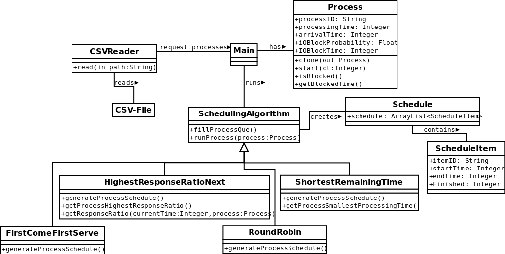

# Documentation: Scheduling Processes

## Code Structure:

##Program flow
1. The main method calls the read method from the CSVReader class to receive a List of processes.
- The main method calls each generateProcessSchedule() function of the SchedulingAlgorithm classes each returning a schedule object
- The main method walks through all processes and prints the processID, the algorithm name and the turnAroundTime from each schedule.

##The SchedulingAlgorithms

### non preemptive
- First Come First Serve (FCFS): The process with the earliest arrival time is processed next.
- Highest Response Ratio Next (HHRN): The process with the highest response ratio ((waiting time + processing time) / processing time) is processed next.

### preemptive
- Round Robin (RR): Each process gets a time slice (quantum) on the CPU.
- ShortestRemaining Time (SRT): The process with the shortest processing time wether a process is running or not is processed next. 
